# RobotFrameWork.Selenium.Web.Tests
**RobotFrameWork.Selenium.Web.Tests** 
___

## Onde está o projeto?
`
https://github.com/RodrigoRamblas/RobotFrameWork.Selenium.Web.Tests
`

## Como clonar o projeto?
```bash
git clone https://github.com/RodrigoRamblas/RobotFrameWork.Selenium.Web.Tests.git
```
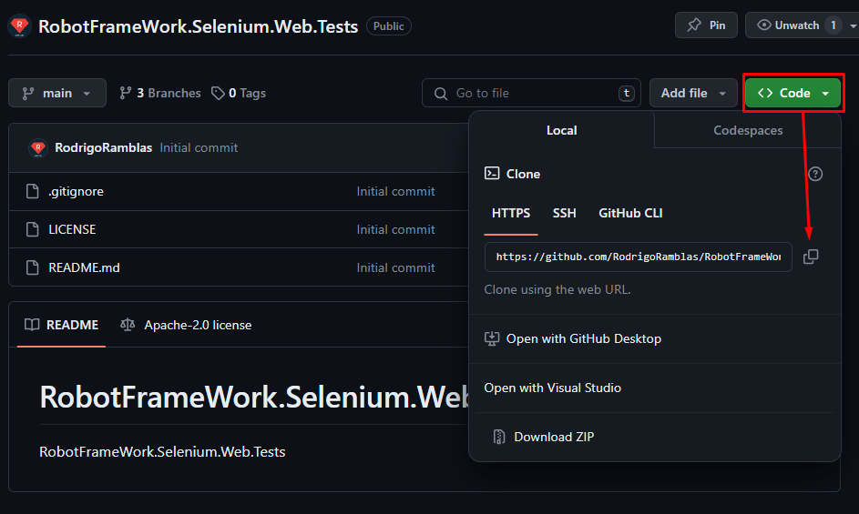
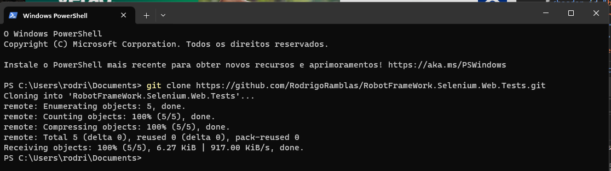

## Vamos usar o GitFlow!
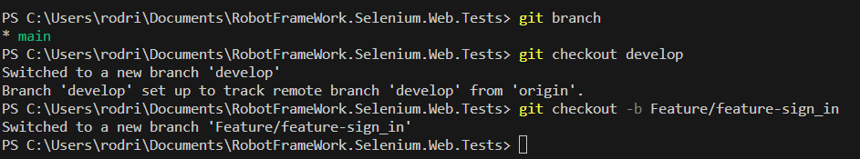

## Estruturas de pastas e readme
    RobotFrameWork.Selenium.Web.Tests
    ├── Config
    |
    ├── Resources
    │   ├── Data
    │   ├── Helper
    │   ├── Steps
    │   └── Pages
    │       
    ├── results
    ├── Tests
    │   
    └── README.md

## Instalação Python

Acesse o site `https://www.python.org/downloads/`

Clique em `Download Python 3.12.2`

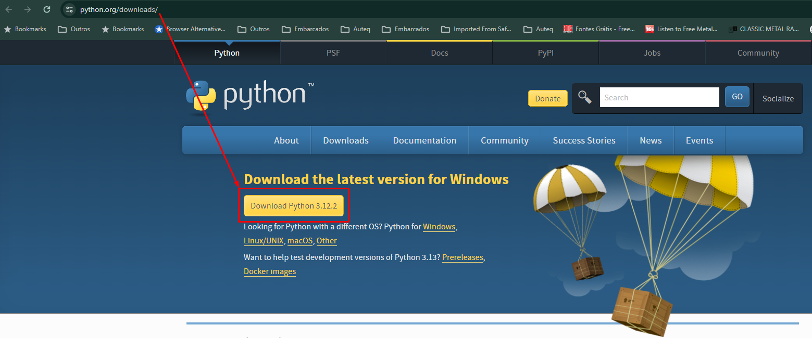

E salve o arquivo python-3.12.2-amd64.exe

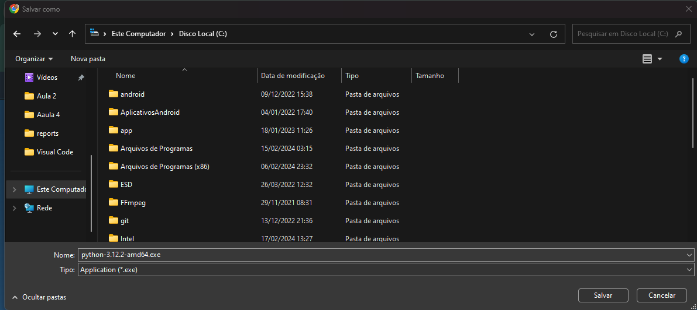

Clique em Use privilégios de Admin e Add python.exe no PATH

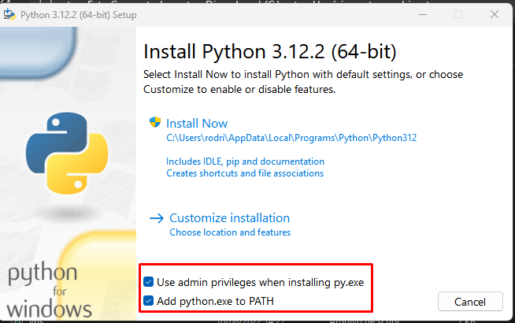

Clique em Instale Agora

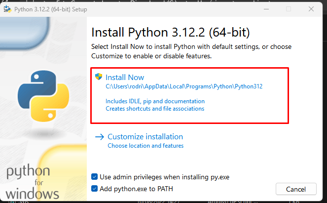

Aguarde finalizar a instalação 

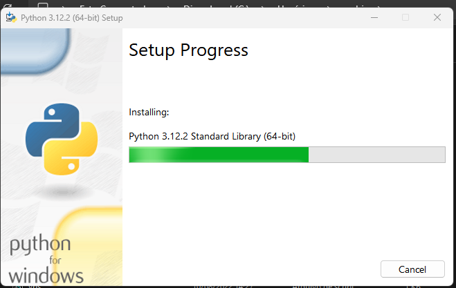

Python instalado com Sucesso, clique em Fechar

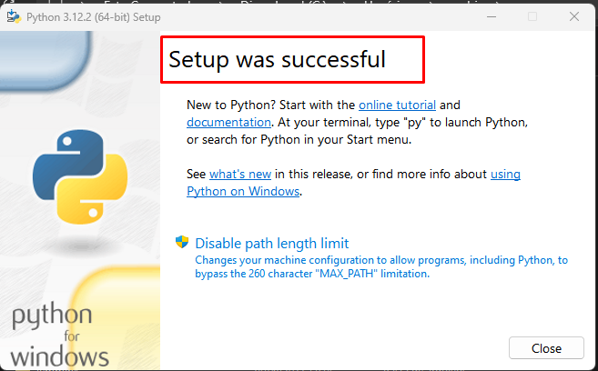

Agora temos que __reiniciar a máquina__.
após reiniciar o seu  compuutador,
**Execute o comando** 
```bash
python --version
```
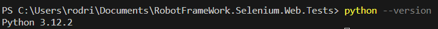

____
## Instalação RobotFrameWork

**Se você já instalou o Python, pode seguir estas etapas para instalar o Robot Framework**

**Instalação via pip**:
Abra o terminal ou prompt de comando e execute o seguinte comando para instalar o Robot Framework e a biblioteca padrão do Selenium:

```bash
pip install robotframework
pip install robotframework
```

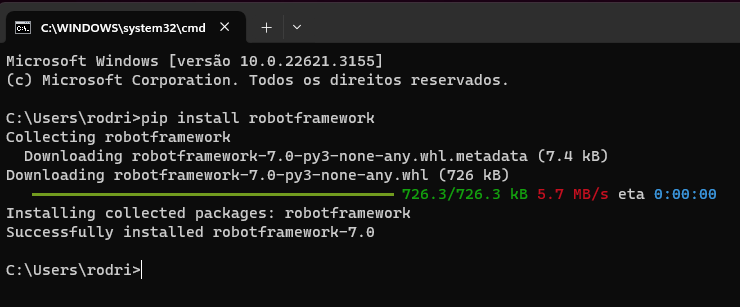
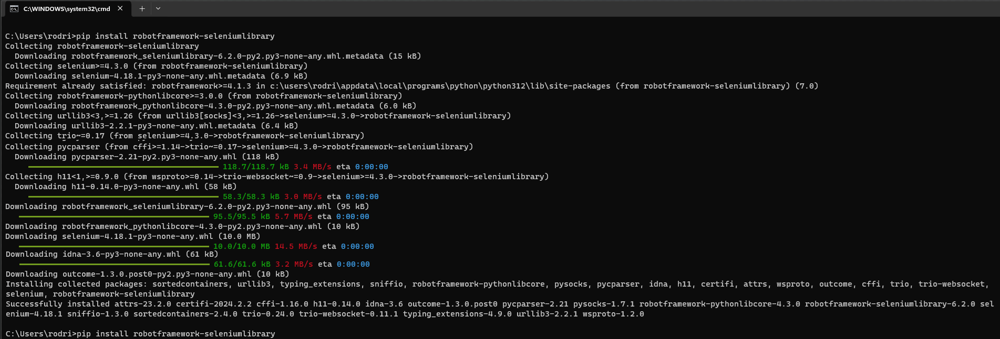

**Verificação da instalação**:
Depois de concluída a instalação, você pode verificar se o Robot Framework foi instalado corretamente digitando o seguinte comando no terminal:

```bash
robot --version
```

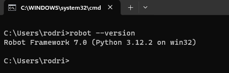

Instalar faker e setuptools
```bash
pip install robotframework-faker
pip install setuptools
```